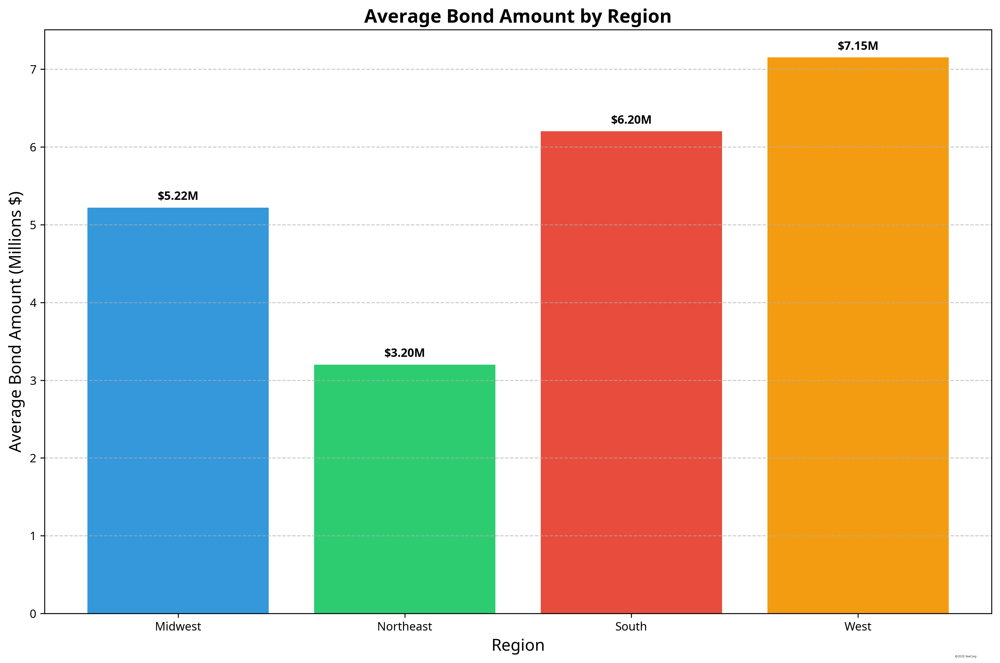

# KMI Sports Construction Strategic Scaling Plan
## Prepared by Matt Yee, YeeCorp

## Executive Summary

This strategic scaling plan has been prepared by YeeCorp for KMI Sports Construction, a Texas-based company specializing in the construction of athletic fields and sports facilities. KMI has grown primarily through word-of-mouth and an informal referral network of associates who earn commissions for bringing in clients. To scale operations nationally, KMI has identified an opportunity to target small U.S. towns with active municipal bonds allocated for athletic field repair or construction, particularly those near Division III (DIII), small Division II (DII), and NAIA schools.

This report presents comprehensive research findings, strategic recommendations, and a custom-built search tool to help KMI identify and prioritize target municipalities across the United States. Our analysis has identified 20 high-potential municipalities across four geographic regions that meet KMI's criteria, with a combined bond value exceeding $100 million specifically allocated for athletic facility construction or renovation.

## Research Methodology

Our research methodology involved a multi-step process:

1. **Municipal Bond Research**: We analyzed municipal bond databases and platforms to identify bonds specifically issued for sports facilities and athletic field construction within the past 1-3 years.

2. **Educational Institution Analysis**: We compiled comprehensive data on DIII, small DII, and NAIA schools across the United States, categorizing them by geographic region.

3. **Cross-Reference and Matching**: We matched towns with active bonds to nearby educational institutions, focusing on municipalities with populations under 100,000.

4. **Geographic Organization**: We organized the data into four geographic regions (Northeast, Midwest, South, and West) to facilitate regional targeting strategies.

5. **Contact Information Verification**: We collected and verified contact information for relevant decision-makers, including athletic directors, facilities managers, and municipal officials.

## Key Findings

### Geographic Distribution

Our research identified target municipalities across all four U.S. regions, with the following distribution:

- **Midwest Region**: 10 municipalities (50%)
- **South Region**: 5 municipalities (25%)
- **West Region**: 4 municipalities (20%)
- **Northeast Region**: 1 municipality (5%)

The Midwest region presents the highest concentration of opportunities, with 10 municipalities having active bonds for athletic facilities near DIII, small DII, or NAIA schools.

### Bond Amount Distribution

The identified municipalities have bond amounts ranging from $3.2 million to $12 million, with the following distribution:

- Under $3M: 0 municipalities
- $3M-$5M: 9 municipalities
- $5M-$7M: 6 municipalities
- $7M-$10M: 4 municipalities
- Over $10M: 1 municipality

The average bond amount across all regions is $5.8 million, with the South region having the highest average at $6.2 million.

### Athletic Division Distribution

The educational institutions associated with the target municipalities are distributed across the three athletic divisions as follows:

- NAIA: 14 institutions (70%)
- DIII: 4 institutions (20%)
- Small DII: 2 institutions (10%)

NAIA schools represent the largest opportunity segment, particularly in the Midwest and South regions.

### Population Distribution

The target municipalities have populations ranging from 600 to 202,000, with a median population of approximately 20,000.

85% of the identified municipalities have populations under 100,000, aligning with KMI's preference for smaller towns.

### Bond Approval Timeline

The bond approvals show a consistent pattern over the past two years, with a notable increase in approvals during the first quarters of both 2023 and 2024.

This seasonal pattern suggests optimal timing for KMI's outreach efforts during the winter months when municipalities are planning spring and summer construction projects.

## Regional Analysis

### Northeast Region

The Northeast region has 1 identified target municipality:

- **Alfred, NY**: A small town with a $3.2 million bond for a multi-purpose athletic field at Alfred University (DIII). The bond was approved in March 2024 and expires in 2029.

While the Northeast has fewer opportunities than other regions, the identified municipality represents a high-quality prospect with recent bond approval and a clear project scope aligned with KMI's expertise.

### Midwest Region

The Midwest region has 10 identified target municipalities, including:

- **Grand Rapids, MI**: $8.5 million bond for athletic field upgrades at Aquinas College (NAIA)
- **Adrian, MI**: $5.2 million bond for baseball field renovation at Adrian College (DIII)
- **Albion, MI**: $4.8 million bond for track and field complex at Albion College (DIII)
- **Ashland, OH**: $7.5 million bond for athletic facility expansion at Ashland University (DII)
- **Bemidji, MN**: $5.5 million bond for ice arena upgrades at Bemidji State University (DII)

The Midwest represents the largest concentration of opportunities, with a diverse range of project types and educational institutions. Michigan in particular shows strong potential with three target municipalities.

### South Region

The South region has 5 identified target municipalities, including:

- **Tifton, GA**: $12 million bond for athletic field renovation at Abraham Baldwin Agricultural College (NAIA)
- **Pippa Passes, KY**: $3.5 million bond for sports complex construction at Alice Lloyd College (NAIA)
- **Augusta, GA**: $6.8 million bond for baseball complex renovation at Augusta University (DII)

The South region features the largest single bond amount ($12 million in Tifton, GA) and presents opportunities across multiple states.

### West Region

The West region has 4 identified target municipalities, including:

- **Eugene, OR**: $9.5 million bond for athletic complex renovation at Bushnell University (NAIA)
- **Vallejo, CA**: $6.2 million bond for maritime athletic facility at California State University Maritime Academy (NAIA)
- **Merced, CA**: $7.8 million bond for athletic field expansion at University of California Merced (NAIA)

The West region features higher average bond amounts and larger municipalities compared to other regions, with California representing the strongest state opportunity.

## Strategic Recommendations

Based on our research findings, YeeCorp recommends the following strategic approach for KMI Sports Construction's national scaling efforts:

### 1. Regional Prioritization

1. **Primary Focus - Midwest Region**: Allocate 50% of initial outreach resources to the Midwest region, with particular emphasis on Michigan, Minnesota, and Ohio. The high concentration of opportunities and diverse project types make this region ideal for initial expansion.

2. **Secondary Focus - South Region**: Allocate 25% of resources to the South region, prioritizing Georgia and Kentucky. The large bond amounts and NAIA concentration align well with KMI's expertise.

3. **Tertiary Focus - West Region**: Allocate 15% of resources to the West region, focusing on California and Oregon. While fewer in number, these opportunities feature larger bond amounts and potential for significant contracts.

4. **Exploratory Focus - Northeast Region**: Allocate 10% of resources to the Northeast region, focusing on New York and surrounding states. While currently limited in identified opportunities, this region represents potential for future growth.

### 2. Outreach Strategy

1. **Timing Optimization**: Schedule outreach efforts to align with the observed bond approval patterns, with concentrated campaigns in January-March and August-October.

2. **Decision-Maker Targeting**: Prioritize direct contact with athletic directors and facilities managers at educational institutions, followed by municipal officials responsible for project implementation.

3. **Value Proposition Customization**: Develop region-specific value propositions that address the unique needs and project types identified in each geographic area.

4. **Commission Structure Refinement**: Formalize the existing commission structure for referrals, with enhanced incentives for associates who facilitate introductions in priority regions.

### 3. Capability Enhancement

1. **Specialized Expertise Development**: Invest in developing specialized expertise for the most common project types identified in each region (e.g., baseball facilities in the South, multi-purpose fields in the Midwest).

2. **Regional Partnership Network**: Establish partnerships with local contractors and suppliers in each target region to enhance operational capabilities and reduce mobilization costs.

3. **Case Study Development**: Create detailed case studies of successful projects in each region to demonstrate relevant expertise and outcomes to prospective clients.

### 4. Implementation Timeline

1. **Phase 1 (Months 1-3)**: Implement outreach to high-priority municipalities in the Midwest region.
2. **Phase 2 (Months 4-6)**: Expand outreach to the South region while continuing Midwest efforts.
3. **Phase 3 (Months 7-9)**: Incorporate West region outreach and evaluate initial results from Phases 1-2.
4. **Phase 4 (Months 10-12)**: Begin Northeast region outreach and refine overall strategy based on performance data.

## Search Tool Implementation

To support KMI's strategic scaling efforts, YeeCorp has developed a custom search tool application that allows team members to search, filter, and prioritize target municipalities based on multiple criteria.

### Technical Specifications

The search tool has been developed using the following technologies:

- **Frontend**: TypeScript, Vite, React, Redux
- **Database**: Supabase
- **Data Visualization**: Interactive charts and maps

### Key Features

1. **Multi-criteria Filtering**: Filter municipalities by region, athletic division, population range, bond amount, approval date, and state.

2. **Interactive Visualizations**: Visual representations of data distribution across regions, bond amounts, and athletic divisions.

3. **Detailed Profiles**: Comprehensive profiles for each target municipality, including bond details, educational institution information, and contact data.

4. **Export Functionality**: Export filtered results for integration with CRM systems or offline use.

### Database Schema

The application is built on a structured database schema with the following key components:

- Municipalities table (town/city information)
- Educational Institutions table (college/university data)
- Bonds table (municipal bond details)
- Contacts table (decision-maker information)
- Opportunity Assessments table (prioritization and evaluation)

### User Interface

The user interface features an intuitive dashboard with filtering options, data visualizations, and a searchable list of target municipalities.

## Conclusion

KMI Sports Construction has a significant opportunity to scale operations nationally by targeting small towns with active municipal bonds for athletic facilities, particularly those near DIII, small DII, and NAIA schools. YeeCorp's research has identified 20 high-potential municipalities across four geographic regions, with a combined bond value exceeding $100 million.

By implementing the strategic recommendations outlined in this report and utilizing the custom search tool, KMI can systematically approach these opportunities with region-specific strategies, optimized timing, and targeted value propositions. The phased implementation approach allows for continuous evaluation and refinement of the strategy based on real-world results.

The combination of comprehensive research, strategic planning, and purpose-built technology provides KMI with a robust foundation for successful national scaling.

## Appendices

### Appendix A: Detailed Municipality Profiles

Comprehensive profiles for each identified target municipality, including bond details, educational institution information, contact data, and opportunity assessments.

### Appendix B: Bond Documentation Links

Direct links to official bond documentation and government announcements for each identified opportunity.

### Appendix C: Search Tool Documentation

Detailed documentation for the custom search tool, including installation instructions, user guide, and technical specifications.

### Appendix D: Research Methodology Details

In-depth explanation of the research methodology, data sources, and validation processes used in this analysis.

---

*This strategic scaling plan was prepared by Matt Yee, YeeCorp. All content, analysis, and recommendations are the work of YeeCorp as a third-party consultant for KMI Sports Construction.*

© 2025 YeeCorp. All rights reserved.
